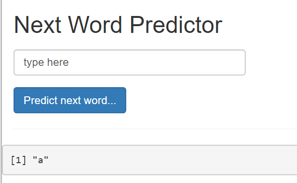

Natural Language Processing: Predicting the next Word
========================================================
author: Yineng Chen
date: 8/4/2020
autosize: true

Project Overview
========================================================

This is a capstone project for Data Science Specialization, a 10-course sequence developed by John Hopkins University, available in Coursera. The data used in this project was given by SwiftKey company. 

Natural Language Processing Model
========================================================
**Packages Used in this project**

- readtext: To read in different types of text data 
- quanteda:  Quantitative text analysis 
- ngram: An n-gram Babbler
- shiny: Web Application Framework for R

**How the data set looks**

The data set is provided by SwiftKey,which includs text from blogs, news and twitter. The text was sampled randomly to built the model. 

How the model works
========================================================
- The next word is predicted based on the previous 1, 2, or 3 words, which is known as N-Gram model, with N=2,3,4,5.

- The probability of a word to appear next is calculated using text sampled from text pools given by SwiftKey. The text pools includs blogs, news and twitter.

- The algorithm try to use the higher N-gram, if it fails it uses the N-1 grams.

- The word 'a' is used when there are no hint for guessing of no pattern is.

Shiny application
========================================================
- The shiny application is available in

- You can also download it from github repository 

Instructions to run it 
========================================================
- Access to the application 

- Enter the sentence in the box, clikc "Predict next word..." button. The app will show the next word predicted.

